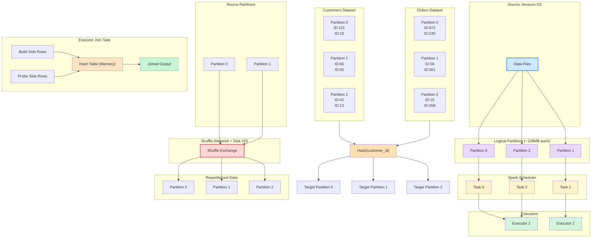

### How Spark Distributed Joins Work
## How Spark Distributed Joins Work

```mermaid
flowchart TB

%% DATA SOURCE
subgraph S3["Source: Amazon S3"]
A["Data Files"]
end

%% PARTITIONS
subgraph Partitions["Logical Partitions (~128MB each)"]
P1["Partition 0"]
P2["Partition 1"]
P3["Partition 2"]
end

A --> P1
A --> P2
A --> P3

%% SCHEDULER
subgraph Scheduler["Spark Scheduler"]
T1["Task 0"]
T2["Task 1"]
T3["Task 2"]
end

P1 --> T1
P2 --> T2
P3 --> T3

%% EXECUTORS
subgraph Executors["Executors"]
E1["Executor 1"]
E2["Executor 2"]
end

T1 --> E1
T2 --> E2
T3 --> E1

%% JOIN PREPARATION

subgraph Customers["Customers Dataset"]
C1["Partition 0<br>ID:101<br>ID:19"]
C2["Partition 1<br>ID:66<br>ID:56"]
C3["Partition 2<br>ID:42<br>ID:13"]
end

subgraph Orders["Orders Dataset"]
O1["Partition 0<br>ID:972<br>ID:245"]
O2["Partition 1<br>ID:56<br>ID:501"]
O3["Partition 2<br>ID:15<br>ID:458"]
end

Customers --> H["Hash(customer_id)"]
Orders --> H

H --> JP1["Target Partition 0"]
H --> JP2["Target Partition 1"]
H --> JP3["Target Partition 2"]

%% SHUFFLE

subgraph ShuffleSource["Source Partitions"]
S1["Partition 0"]
S2["Partition 1"]
end

subgraph Shuffle["Shuffle (Network + Disk I/O)"]
X["Shuffle Exchange"]
end

subgraph ShuffleTarget["Repartitioned Data"]
R1["Partition 0"]
R2["Partition 1"]
R3["Partition 2"]
end

S1 --> X
S2 --> X
X --> R1
X --> R2
X --> R3

%% EXECUTOR JOIN

subgraph ExecutorTask["Executor Join Task"]
B["Build Side Rows"]
HT["Hash Table (Memory)"]
P["Probe Side Rows"]
J["Joined Output"]
end

B --> HT
P --> HT
HT --> J


%% STYLING

style A fill:#cfe8ff,stroke:#1f6feb,stroke-width:2px

style P1 fill:#e8d9ff
style P2 fill:#e8d9ff
style P3 fill:#e8d9ff

style T1 fill:#fff3cd
style T2 fill:#fff3cd
style T3 fill:#fff3cd

style E1 fill:#d4f4dd
style E2 fill:#d4f4dd

style H fill:#ffe0b2

style X fill:#ffd6d6,stroke:#d73a49,stroke-width:2px

style HT fill:#ffe4c4
style J fill:#c6f6d5
```
