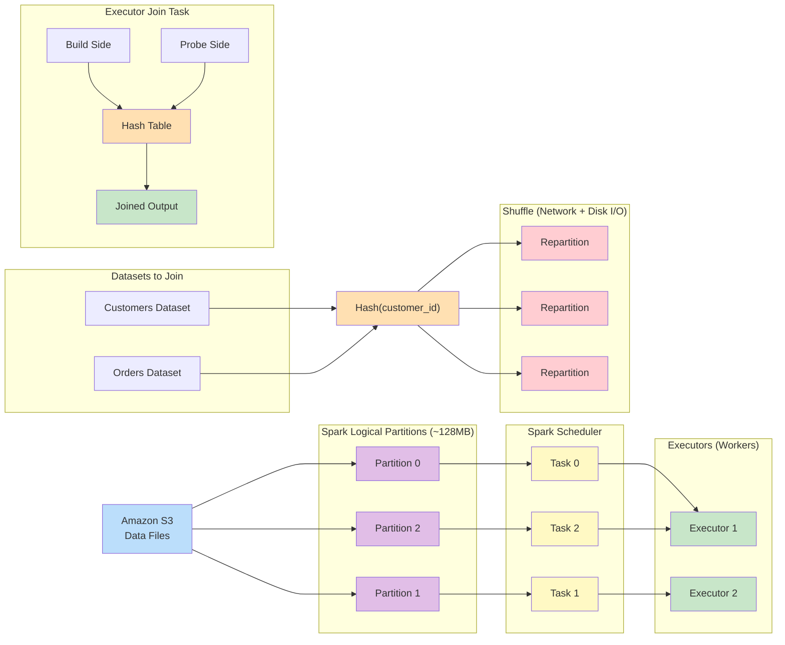

## How Spark Distributed Joins Work

```mermaid
%%{init: {'theme':'default'}}%%

flowchart LR

%% DATA SOURCE
A["Amazon S3<br>Data Files"]

%% PARTITIONS
subgraph Partitioning["Spark Logical Partitions (~128MB)"]
P1["Partition 0"]
P2["Partition 1"]
P3["Partition 2"]
end

A --> P1
A --> P2
A --> P3

%% SCHEDULER
subgraph Scheduler["Spark Scheduler"]
T1["Task 0"]
T2["Task 1"]
T3["Task 2"]
end

P1 --> T1
P2 --> T2
P3 --> T3

%% EXECUTORS
subgraph Executors["Executors (Workers)"]
E1["Executor 1"]
E2["Executor 2"]
end

T1 --> E1
T2 --> E2
T3 --> E1

%% DATASETS
subgraph Datasets["Datasets to Join"]
C["Customers Dataset"]
O["Orders Dataset"]
end

%% HASH
H["Hash(customer_id)"]

C --> H
O --> H

%% SHUFFLE
subgraph Shuffle["Shuffle (Network + Disk I/O)"]
S1["Repartition"]
S2["Repartition"]
S3["Repartition"]
end

H --> S1
H --> S2
H --> S3

%% JOIN
subgraph Join["Executor Join Task"]
B["Build Side"]
HT["Hash Table"]
P["Probe Side"]
J["Joined Output"]
end

B --> HT
P --> HT
HT --> J

%% BOX COLORS
style A fill:#BBDEFB
style P1 fill:#E1BEE7
style P2 fill:#E1BEE7
style P3 fill:#E1BEE7

style T1 fill:#FFF9C4
style T2 fill:#FFF9C4
style T3 fill:#FFF9C4

style E1 fill:#C8E6C9
style E2 fill:#C8E6C9

style H fill:#FFE0B2

style S1 fill:#FFCDD2
style S2 fill:#FFCDD2
style S3 fill:#FFCDD2

style HT fill:#FFE0B2
style J fill:#C8E6C9

```
