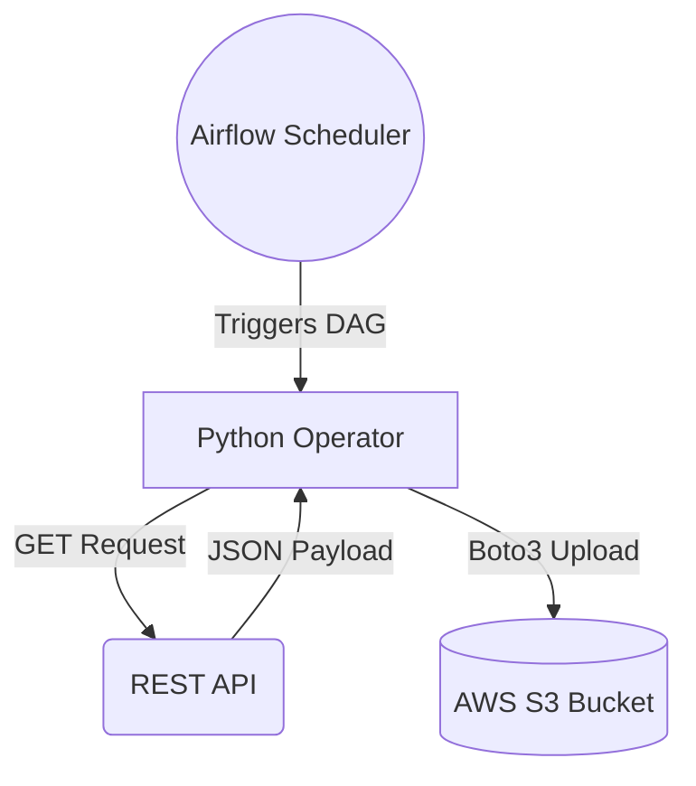

# Project 03: Satellite

**Tier:** Beginner | **Complexity Level:** 03/20
**Primary Focus:** Basic Airflow

## 📝 Overview
Use Airflow to schedule API pulls of the ISS location every 10 minutes and dump raw JSON to cloud storage.

## 🏗️ Architecture Diagram


## 🛠️ Tech Stack
* Apache Airflow, Python, S3

## 📂 Directory Structure
* `/src` - Core processing scripts
* `/tests` - Data quality and unit tests
* `/dags` - Orchestration logic
* `/infrastructure` - IaC and Docker setups
* `/config` - Pipeline configurations

## 📊 Data Sources & Requirements
* **Primary Data Source:** [Open Notify API (ISS Location)](https://www.google.com/search?q=Open+Notify+API+(ISS+Location))
* **Goal:** Set up infrastructure, ingest raw data, and implement **Basic Airflow**.

## 🚀 Quick Start
```bash
make setup
make up
make run
```
