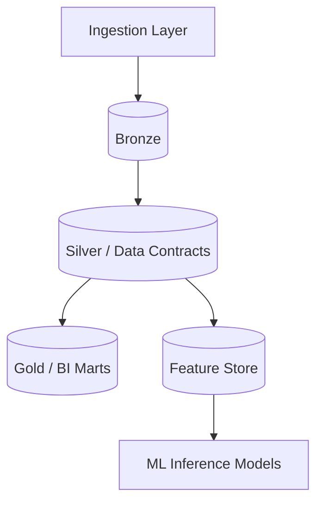

# Project 20: Singularity

**Tier:** Ultimate | **Complexity Level:** 20/20
**Primary Focus:** Full Enterprise Platform

## 📝 Overview
Governed, self-service, hybrid architecture supporting BI and ML simultaneously.

## 🏗️ Architecture Diagram


## 🛠️ Tech Stack
* Medallion, Real-time + ML

## 📂 Directory Structure
* `/src` - Core processing scripts
* `/tests` - Data quality and unit tests
* `/dags` - Orchestration logic
* `/infrastructure` - IaC and Docker setups
* `/config` - Pipeline configurations

## 📊 Data Sources & Requirements
* **Primary Data Source:** [Enterprise data](https://www.google.com/search?q=Enterprise+data)
* **Goal:** Set up infrastructure, ingest raw data, and implement **Full Enterprise Platform**.

## 🚀 Quick Start
```bash
make setup
make up
make run
```
