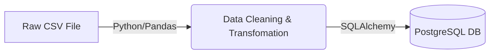

# Project 01: Meteor

**Tier:** Beginner | **Complexity Level:** 01/20
**Primary Focus:** Batch ETL

## 📝 Overview
Build a daily batch ETL script to extract raw CSVs, clean them, and load them into a local Postgres database.

## 🏗️ Architecture Diagram


## 🛠️ Tech Stack
* Python, Pandas, PostgreSQL

## 📂 Directory Structure
* `/src` - Core processing scripts
* `/tests` - Data quality and unit tests
* `/dags` - Orchestration logic
* `/infrastructure` - IaC and Docker setups
* `/config` - Pipeline configurations

## 📊 Data Sources & Requirements
* **Primary Data Source:** [Kaggle Space Missions Dataset](https://www.google.com/search?q=Kaggle+Space+Missions+Dataset)
* **Goal:** Set up infrastructure, ingest raw data, and implement **Batch ETL**.

## 🚀 Quick Start
```bash
make setup
make up
make run
```
