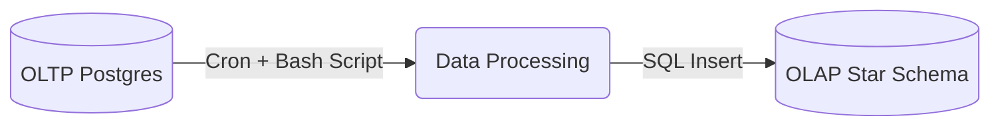

# Project 02: Comet

**Tier:** Beginner | **Complexity Level:** 02/20
**Primary Focus:** Simple Warehouse

## 📝 Overview
Design a simple star schema data warehouse and load dimensional data.

## 🏗️ Architecture Diagram


## 🛠️ Tech Stack
* PostgreSQL, Bash, Cron

## 📂 Directory Structure
* `/src` - Core processing scripts
* `/tests` - Data quality and unit tests
* `/dags` - Orchestration logic
* `/infrastructure` - IaC and Docker setups
* `/config` - Pipeline configurations

## 📊 Data Sources & Requirements
* **Primary Data Source:** [NASA Exoplanet Archive](https://www.google.com/search?q=NASA+Exoplanet+Archive)
* **Goal:** Set up infrastructure, ingest raw data, and implement **Simple Warehouse**.

## 🚀 Quick Start
```bash
make setup
make up
make run
```
