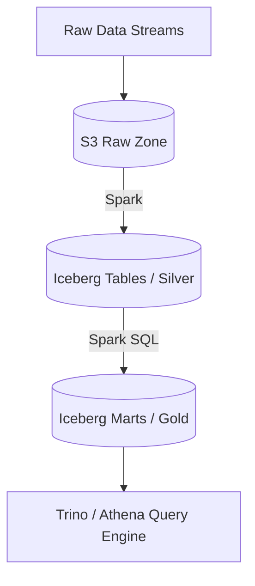

# Project 05: Asteroid

**Tier:** Intermediate | **Complexity Level:** 05/20
**Primary Focus:** Lakehouse Architecture

## 📝 Overview
Establish a Lakehouse to store large volumes of structured and semi-structured data.

## 🏗️ Architecture Diagram


## 🛠️ Tech Stack
* Apache Iceberg, AWS S3

## 📂 Directory Structure
* `/src` - Core processing scripts
* `/tests` - Data quality and unit tests
* `/dags` - Orchestration logic
* `/infrastructure` - IaC and Docker setups
* `/config` - Pipeline configurations

## 📊 Data Sources & Requirements
* **Primary Data Source:** [Global Weather Data](https://www.google.com/search?q=Global+Weather+Data)
* **Goal:** Set up infrastructure, ingest raw data, and implement **Lakehouse Architecture**.

## 🚀 Quick Start
```bash
make setup
make up
make run
```
