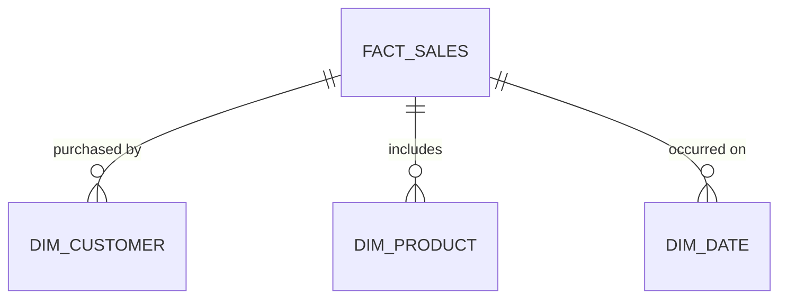

# Project 07: Nebula

**Tier:** Intermediate | **Complexity Level:** 07/20
**Primary Focus:** Data Modelling Depth

## 📝 Overview
Build a deep Kimball dimensional model (Fact/Dimensions, SCD Type 2).

## 🏗️ Architecture Diagram


## 🛠️ Tech Stack
* dbt, Kimball

## 📂 Directory Structure
* `/src` - Core processing scripts
* `/tests` - Data quality and unit tests
* `/dags` - Orchestration logic
* `/infrastructure` - IaC and Docker setups
* `/config` - Pipeline configurations

## 📊 Data Sources & Requirements
* **Primary Data Source:** [Retail dataset](https://www.google.com/search?q=Retail+dataset)
* **Goal:** Set up infrastructure, ingest raw data, and implement **Data Modelling Depth**.

## 🚀 Quick Start
```bash
make setup
make up
make run
```
