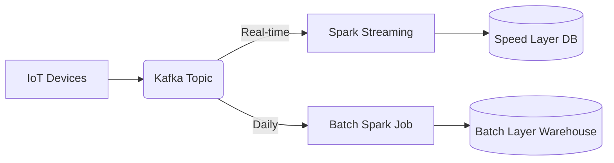

# Project 09: Quasar

**Tier:** Advanced | **Complexity Level:** 09/20
**Primary Focus:** Streaming + Batch Hybrid

## 📝 Overview
Build a lambda architecture handling real-time streams and batch reconciliations.

## 🏗️ Architecture Diagram


## 🛠️ Tech Stack
* Kafka, Spark Streaming

## 📂 Directory Structure
* `/src` - Core processing scripts
* `/tests` - Data quality and unit tests
* `/dags` - Orchestration logic
* `/infrastructure` - IaC and Docker setups
* `/config` - Pipeline configurations

## 📊 Data Sources & Requirements
* **Primary Data Source:** [IoT Telemetry](https://www.google.com/search?q=IoT+Telemetry)
* **Goal:** Set up infrastructure, ingest raw data, and implement **Streaming + Batch Hybrid**.

## 🚀 Quick Start
```bash
make setup
make up
make run
```
