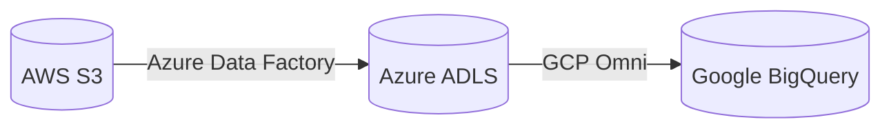

# Project 18: Andromeda

**Tier:** Elite | **Complexity Level:** 18/20
**Primary Focus:** Multi-cloud

## 📝 Overview
Orchestrate data movement across 3 major cloud providers.

## 🏗️ Architecture Diagram


## 🛠️ Tech Stack
* ADF, BigQuery, S3

## 📂 Directory Structure
* `/src` - Core processing scripts
* `/tests` - Data quality and unit tests
* `/dags` - Orchestration logic
* `/infrastructure` - IaC and Docker setups
* `/config` - Pipeline configurations

## 📊 Data Sources & Requirements
* **Primary Data Source:** [Inter-cloud](https://www.google.com/search?q=Inter-cloud)
* **Goal:** Set up infrastructure, ingest raw data, and implement **Multi-cloud**.

## 🚀 Quick Start
```bash
make setup
make up
make run
```
