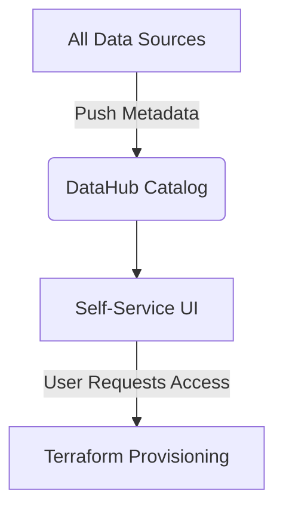

# Project 19: EventHorizon

**Tier:** Elite | **Complexity Level:** 19/20
**Primary Focus:** Platform Engineering

## 📝 Overview
Create a self-service platform with metadata management.

## 🏗️ Architecture Diagram


## 🛠️ Tech Stack
* DataHub

## 📂 Directory Structure
* `/src` - Core processing scripts
* `/tests` - Data quality and unit tests
* `/dags` - Orchestration logic
* `/infrastructure` - IaC and Docker setups
* `/config` - Pipeline configurations

## 📊 Data Sources & Requirements
* **Primary Data Source:** [Platform Metrics](https://www.google.com/search?q=Platform+Metrics)
* **Goal:** Set up infrastructure, ingest raw data, and implement **Platform Engineering**.

## 🚀 Quick Start
```bash
make setup
make up
make run
```
