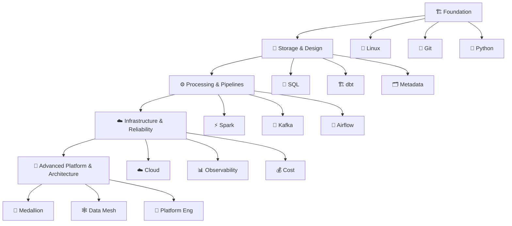

#  Data Engineering Roadmap (FAANG-style)
*This roadmap guides you from beginner to senior data engineer in clear phases, based on real industry experience and hiring expectations.*

## 🧭 **Exploration** *.. clarity not any skill* 

 Before learning anything. Make sure you understand the role clearly so you know what you’re signing up for before investing your time and effort.

 
  
**Data engineering**, is not not about flashy visuals, dashboards or charts — it’s about systems, pipelines, fixing issues, and working behind the scenes. 
It’s about <b>building the data foundation</b> that everything else depends on.

As a data engineer, your job is to:

- Move data between systems
- Clean messy, unreliable data
- Build pipelines that run every day
- Fix things when they break

Your work is often invisible, but when data is wrong or missing, everyone feels it. This role is less about writing perfect code and more about solving real data problems. 
You’ll debug frequently, investigate failures, and learn how data systems behave in the real world.

### 📈 Maturity Ladder

| Level | Focus |
|------|------|
| Junior | Pipelines, SQL, debugging |
| Mid | Distributed systems, cloud, orchestration |
| Senior | Architecture, reliability, cost optimisation |
| Staff | Platform design, governance, strategy 

### ⚖️Decide is data engineering right for you? 

  - [ ]  “**Yes** — this feels right. I want to commit and learn it properly.”
  - [ ]  “**No** — this isn’t for me, and that’s okay.”
*Choose one that matters most and be honest with yourself. Ignore hype and salary — ask whether you would genuinely enjoy doing this work every week.*

---

🗺️ Visual Roadmap

## 🏗️ **Foundations** *.. the building blocks*
We’re building your expertise from the ground up so that working with code and data feels like a second language. The goal is to move beyond <i>rushing through tutorials</i> and instead focus on <b>genuine effort and deep understanding</b> so that working with data and code feels natural.

    Mastery is not a function of genius or talent, it is a function of time and intense focus.

🧰 Core Engineering 

  
| 🔥 Priority | 🧩 Step | 📂 Category | 📌 Req | ⭐ Diff | 🎚️ Level | ⏱️ Weeks | 📝 Notes | 🔗 Repo | 📚 Book |
|:--:|------|----------|:--:|:--:|:--:|:--:|------|------|------|
|  🔥 | 🐧 Linux / CLI Basics | Fundamentals | M | ⭐⭐ | 🟢 | 1–2 | Navigate systems | | The Linux Command Line — Shotts |
|  🔥 | 🌿 Git & GitHub | Fundamentals | M | ⭐⭐ | 🟢 | 1 | Version control | | Pro Git — Chacon |
|   | 📜 Shell Scripting | Coding | O | ⭐⭐ | 🟢 | 1 | Automation | | Bash Cookbook — Albing |
| 🔥 | 🐍 Python | Coding | M | ⭐⭐⭐⭐ | 🔴 | 3–4 | Data scripting | | Fluent Python — Ramalho |
| | 🌐 Networking | Fundamentals | O | ⭐⭐ | 🟢 | 1 | System communication | | Computer Networking — Kurose |

💾 Data Storage & Design

> Structure and store data efficiently

| 🔥 Priority | 🧩 Step | 📂 Category | 📌 Req | ⭐ Diff | 🎚️ Level | ⏱️ Weeks | 📝 Notes | 🔗 Repo | 📚 Book |
|:--:|------|----------|:--:|:--:|:--:|:--:|------|------|------|
| 🔥 | 🗄️ Databases | Concepts | M | ⭐⭐⭐ | 🟡 | 2–3 | Storage | | Database System Concepts — Silberschatz |
| 🔥 | 🧮 SQL | Coding | M | ⭐⭐⭐⭐ | 🔴 | 3–4 | Querying | | SQL Performance Explained — Winand |
| 🔥 | 🧩 Data Modelling | Concepts | M | ⭐⭐⭐⭐ | 🔴 | 2–3 | Schema design | | Data Modeling Made Simple — Hoberman |
| 🔥 | 🏗️ dbt | Transformation | M | ⭐⭐⭐ | 🟡 | 1–2 | Warehouse transforms | | Analytics Engineering — S. Smith |
| 🔥 | 📜 Data Contracts | Governance | M | ⭐⭐⭐ | 🟡 | 1–2 | Schema guarantees | | Designing Data-Intensive Apps — Kleppmann |
| 🔥 | 🗂️ Metadata & Catalog | Platform | M | ⭐⭐⭐ | 🟡 | 1–2 | Lineage | | Fundamentals of Data Engineering — Reis |
| 🔥 | 🏢 Warehousing | Concepts | M | ⭐⭐⭐⭐ | 🔴 | 2–3 | Analytics store | | Data Warehouse Toolkit — Kimball |
| 🔥 | 🏞️ Lakehouse | Concepts | M | ⭐⭐⭐ | 🟡 | 2 | Delta/Iceberg | | Lakehouse Architecture — Vohra ||

⚙️ Data Processing & Pipelines

> Move data at scale

| 🔥 Priority | 🧩 Step | 📂 Category | 📌 Req | ⭐ Diff | 🎚️ Level | ⏱️ Weeks | 📝 Notes | 🔗 Repo | 📚 Book |
|:--:|------|----------|:--:|:--:|:--:|:--:|------|------|------|
| 🔥 | 🔗 APIs | Fundamentals | M | ⭐⭐⭐ | 🟡 | 2 | Integration | | API Design Patterns — Geewax |
| 🔥 | 🔄 ETL / ELT | Concepts | M | ⭐⭐⭐ | 🟡 | 2 | Pipelines | | Fundamentals of Data Engineering — Reis |
| 🔥 | 🔁 CDC | Streaming | M | ⭐⭐⭐⭐ | 🔴 | 2–3 | DB change capture | | Kafka: The Definitive Guide — Narkhede |
| 🔥 | ⚡ Spark | Compute | M | ⭐⭐⭐⭐⭐ | 🔴 | 4–6 | Distributed compute | | Spark Definitive Guide — Chambers |
| 🔥 | 📨 Kafka | Streaming | M | ⭐⭐⭐⭐ | 🔴 | 2–3 | Event pipelines | | Kafka in Action — Stopford |
| 🔥 | 🎯 Airflow | Orchestration | M | ⭐⭐⭐⭐ | 🔴 | 2–3 | Scheduling | | Data Pipelines Pocket Reference — Densmore |
| 🔥 | 🔄 Reverse ETL | O | ⭐⭐⭐ | 🟡 | 1 | Modern Data Stack | ||

☁️ Infrastructure & Reliability

> Secure, scalable, observable systems

| 🔥 Priority | 🧩 Step | 📂 Category | 📌 Req | ⭐ Diff | 🎚️ Level | ⏱️ Weeks | 📝 Notes | 🔗 Repo | 📚 Book |
|:--:|------|----------|:--:|:--:|:--:|:--:|------|------|------|
| 🔥 | ☁️ Cloud | Infra | M | ⭐⭐⭐⭐ | 🔴 | 3–4 | Cloud data services | | Cloud Architecture Patterns — Fehling |
| 🔥 | 📊 Observability | Reliability | M | ⭐⭐⭐ | 🟡 | 1–2 | Pipeline health | | Observability Engineering — Majors |
| 🔥 | 🐳 Docker | Infra | O | ⭐⭐⭐ | 🟡 | 1–2 | Containers | | Docker Deep Dive — Mouat |
| 🔥 | 🐞 Debugging | Reliability | M | ⭐⭐⭐ | 🟡 | 1–2 | Failures | | Debugging Teams — Ousterhout |
| 🔥 | 🛡️ Governance | Governance | M | ⭐⭐ | 🟢 | 1–2 | Privacy | | Data Governance — Seiner |
| 🔥 | 🔐 Security & IAM  | Security | M | ⭐⭐ | 🟢 | 1–2 | Cloud Security | | |
| 🔥 | 💰 Cost Optimisation | FinOps | M | ⭐⭐⭐ | 🟡 | 1–2 | Cloud economics | | Cloud FinOps — J. Willis |
| 🔥 | 🏗️ IaC  | Infra | O | ⭐⭐⭐ | 🟡 | 1–2 | Terraform Up| |  |

🚀 Advanced Platform & Architecture

> Enterprise-scale data platform design

| 🔥 Priority | 🧩 Step | 📂 Category | 📌 Req | ⭐ Diff | 🎚️ Level | ⏱️ Weeks | 📝 Notes | 🔗 Repo | 📚 Book |
|:--:|------|----------|:--:|:--:|:--:|:--:|------|------|------|
| 🔥 | 🧱 Medallion | Architecture | M | ⭐⭐⭐⭐ | 🔴 | 2 | Bronze-Silver-Gold | | Designing Data Platforms — Kleppmann (chapters) |
| 🔥 | 🕸️ Data Mesh | Architecture | O | ⭐⭐⭐⭐ | 🔴 | 2–3 | Domain ownership | | Data Mesh — Zhamak Dehghani |
| 🔥 | ⚡ Streaming Architecture | Architecture | O | ⭐⭐⭐⭐ | 🔴 | 2–3 | Event design | | Streaming Systems — Akidau |
| 🔥 | 🌍 Multi-cloud | Architecture | O | ⭐⭐⭐⭐ | 🔴 | 2–3 | Cross-cloud | | Cloud Native DevOps — Burns |
| 🔥 | 🏢 Platform Engineering | Platform | M | ⭐⭐⭐⭐ | 🔴 | 2–3 | Self-service infra | | Platform Engineering — M. Richards |
| 🔥 | 📊 SLAs/SLOs | Reliability | M | ⭐⭐⭐ | 🟡 | 1–2 | Reliability | | Site Reliability Engineering — Google |

🏗️ System Design Templates

- Streaming architecture template 
- Warehouse template 
- Medallion design doc 
- Data mesh blueprint 
- Platform engineering blueprint 

 *Note: Progress depends on prior experience and weekly time commitment. Quality of understanding > Speed of completion.*

---

## 📊 Progress Tracker (Clickable)
- [ ] 🏗️ Foundations
- [ ] 💾 Storage
- [ ] ⚙️ Pipelines
- [ ] ☁️ Infrastructure
- [ ] 🚀 Architecture

---

## 🎯 **UDIM - Capstone Project** *.. the end* 

This is where learning stops being theoretical. Projects are how you turn concepts, tools, and code into <b>real understanding</b>.

| Level | Project |
|-------|--------|
| Beginner | API → Warehouse pipeline |
| Intermediate | Airflow + dbt project |
| Advanced | Kafka + CDC streaming |
| Expert | Full Medallion data platform |

**One solid project is enough** if it’s done properly.
1. **Extraction:** Scrape a public API using **Python** (e.g., Weather or Finance data).
2. **Containerization:** Wrap your scraper in a **Docker** container.
3. **Storage:** Land the raw data in a **Cloud Bucket** (S3/GCS) in **JSON** format.
4. **Transformation:** Use **SQL** or **Spark** to clean the data and convert it to **Parquet**.
5. **Modeling:** Load it into a **Lakehouse** using a Star Schema.
6. **Orchestration:** Schedule the whole flow using **Airflow**.
7. **Reliability:** Implement **Data Quality** checks (e.g., Great Expectations) and **Logging**.

---

## 💼 **Interview Prep** *.. prepare and get hired* 

At this point, you won’t know 100% of data engineering, and that’s completely normal. The good news is you already have around 70% of the skills needed to start applying. There’s no reason to wait anymore. Now it’s time to prepare yourself, put your profile together, and start applying for jobs.

### 📌 Interview Stages

### 🧠 Interview Question Bank

 

---

## 📖 How to use this 
1. **Fork** this repository.
2. Mark your progress by changing `[ ]` to `[x]`.
3. Commit your notes or small practice scripts to this repo as you learn.
4. **Master the foundations:** Don't move to Spark until your SQL is solid. Don't move to Airflow until your Python is clean.

## ⏱️ Learning Time Planner
| Weekly Hours | Estimated Duration |
|-------------|-------------------|
| 5 hrs | 18–24 months |
| 10 hrs | 12–15 months |
| 20 hrs | 6–8 months |

📅 Average estimated is ~6–9 Months (Deep Dive)
---

---

